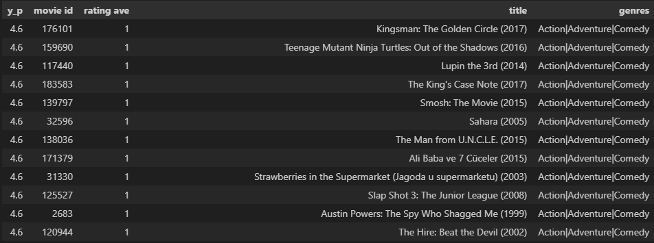

## Movie Recommendation System using Content-based Filtering

### Introduction

This project is a movie recommendation system using content-based filtering. The dataset used is the MovieLens dataset, which contains 100,000 ratings from 1000 users on 1700 movies. The dataset can be found [here](https://grouplens.org/datasets/movielens/). The dataset is split into training and testing sets, with 80% of the ratings in the training set and 20% in the testing set. The training set is used to train the model, and the testing set is used to evaluate the model. The model is evaluated using the Root Mean Squared Error (RMSE) metric.

### Data Preprocessing

The dataset is split into training and testing sets, with 80% of the ratings in the training set and 20% in the testing set. The training set is used to train the model, and the testing set is used to evaluate the model. The model is evaluated using the Root Mean Squared Error (RMSE) metric. Movies are also filtered to contain more recent films, with the latest movie being released in 1998. This is to ensure that the movies recommended are more relevant to the user. The dataset is also filtered to contain only movies that have been rated by at least 50 users. This is to ensure that the movies recommended are more popular and well-known. The content used to filter recommendation is by looking at how the user has rated the genres of movies. The genres of movies are one-hot encoded, and the user's ratings are multiplied with the one-hot encoded genres. The sum of the ratings for each genre is then calculated. The genre with the highest rating is then used to recommend movies to the user. The movies recommended are the top 40 movies with the highest ratings for the genre.

### Model

The model used is a simple neural network with 2 hidden layers. The input layer has 19 nodes, which is the number of genres. The first hidden layer has 10 nodes, and the second hidden layer has 5 nodes. The output layer has 1 node, which is the predicted rating. The activation function used is the ReLU function. The loss function used is the Mean Squared Error (MSE) function. The optimizer used is the Adam optimizer. The model is trained for 30 epochs with a batch size of 256 for each epoch. The model is evaluated using the Root Mean Squared Error (RMSE) metric.


```python
# example user vector for a new user

new_user_id = 30000
new_rating_ave = 0.0
new_action = 5.0
new_adventure = 5.0
new_animation = 0.0
new_childrens = 0.0
new_comedy = 5.0
new_crime = 0.0
new_documentary = 0.0
new_drama = 0.0
new_fantasy = 5.0
new_film_noir = 0.0
new_horror = 0.0
new_imax = 0.0
new_musical = 0.0
new_mystery = 0.0
new_romance = 0.0
new_scifi = 0.0
new_thriller = 0.0
new_war = 0.0
new_western = 0.0

user_vec = np.array([[new_user_id, new_rating_ave,
                      new_action, new_adventure, new_animation, new_childrens,
                      new_comedy, new_crime, new_documentary,
                      new_drama, new_fantasy, new_film_noir, new_horror, new_imax, new_mystery,
                      new_musical, new_romance, new_scifi, new_thriller, new_war, 
                      new_western]])
```

### Result for User id: 30000



### Conclusion

The model is able to recommend movies to the user based on the genres of movies that the user has rated. Therefore, the model is able to recommend movies that the user has not watched before.

[Notebook](movieRec-train.ipynb)